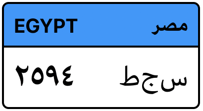

# Egyptian License Plate Generator

## Intro
**react-license-plate-egypt** is a react component that displays a visual representation of an Egyptian license plate given from the text value of the plate number. 

## How to use it

```jsx
<LicensePlate number={'سجط ٢٥٩٤'} />
```



### Props

`LicensePlate` accepts 3 props:
* `number`: The text value of the plate which includes both the alphabetical and numeric parts of the plate. It has to be a valid Unicode string within the range of arabic characters. This component automatically detaches the letters for proper presentaion, it also displays the corresponding parts (digits/letters) on the correct sides (regardless of where they are in the string provided).
* `width`: The width in pixels. The component will preserver the aspect ratio of the plate so you don't have to set a height. Default value is `200px`.
* `vehicle`: The type of vehicle. This decides the color of the top part of the plate. You can import the enum `VehicleType` which contains all possible types. Default is `VehicleType.PRIVATE` which is presented as light blue.
